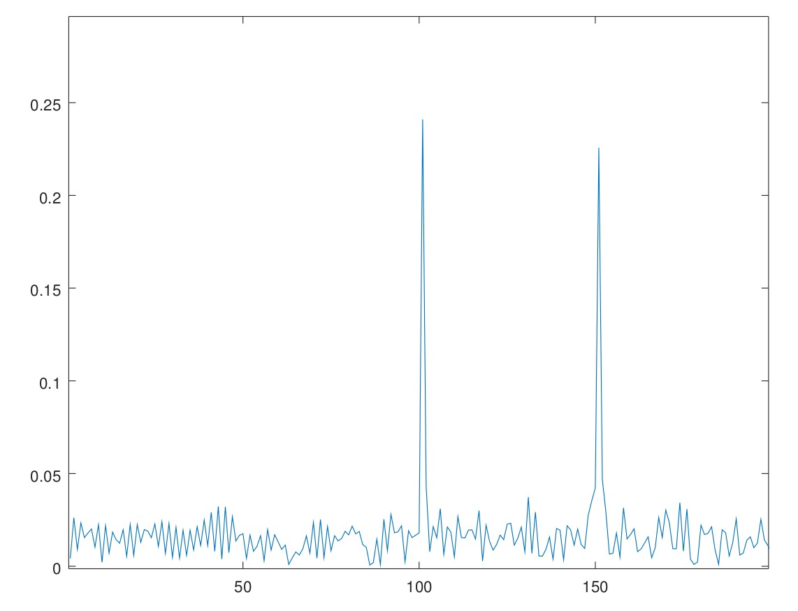
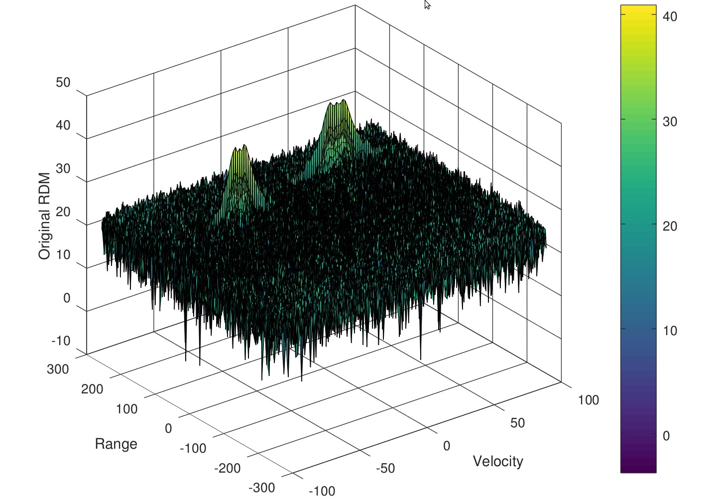
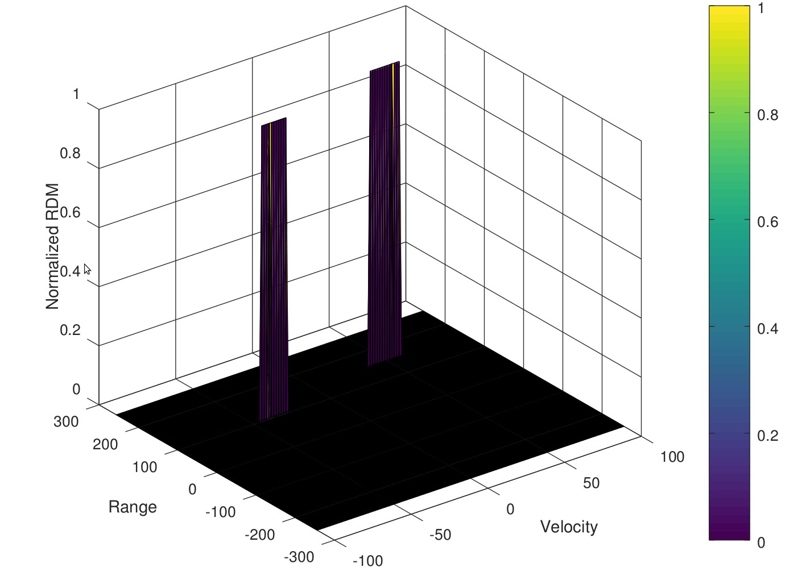

# Radar Obstacle detection
This is the fourth project of Udacity's Sensor Fusion Nanodegree program.

In this project, we are required to simulate a radar transmit and received signal and then process the received radar signal to detect the obstacle's range using 1-dimensional FFT and then detect the velocity of moving obstacles using the 2D FFT using doppler effect.


### Step 1: Specify the radars specification

The following image shows the radar specfication for which it needs to be designed.

Frequency of operation = 77GHz
Max Range = 200m
Range Resolution = 1 m
Max Velocity = 100 m/s

We then use the following formula to generate the distance_resolution, chrip_time of the signal and the slope of the generated signal

1. dist_res = c / (2*Bandwidth);
2. chirp_time = 5.5 * 2 * range_max/c;
3. slope = B/chirp_time;

```
B = c/(2* dist_res); % meter

Tchirp = 5.5 * 2 * range_max/c; % sec

alpha = B/Tchirp; % slope

```

### Step 2: Simulate the transmitted and received signal based of signal equations.

We then generate the transmitted and recieved signal based on the following equation.

**Transmitted wave Tx = cos(2&pi;( f<sub>c</sub>t + (&alpha; x t<sup>2</sup>)/2))**

The recieved wave signal is just the time delayed version of the transmitted signal

**Received wave Rx = cos(2&pi;( f<sub>c</sub> &delta;t + (&alpha; x &delta;t<sup>2</sup>)/2))**

where 
- f<sub>c</sub> - carrier frequency (77 GHz)
- &alpha; - slope of the transmitted signal (signal_bandwidth/chirp_time)
```
for i=1:length(t)     
  
    t_ = t(i);
    
    Tx(i) = cos(2*pi* (fc*t_ + (alpha*t_^2/2)));
    
    %target 1
    vehicle_dist = R + (initial_vel * t_);    
    return_time = 2*vehicle_dist/c;
    del_t = t_-return_time;
    
    %simulating one more targer at 100 meter range and 40 m/s approach velocity
    vehicle_dist1 = 100 + (-40 * t_);    
    return_time1 = 2*vehicle_dist1/c;    
    del_t1 = t_-return_time1;    
    
    %adding both targets to the return signal
    Rx (i) = cos(2*pi* (fc*del_t + (alpha *del_t^2/2 ))) + cos(2*pi* (fc*del_t1 + (alpha *del_t1^2/2 )));
    
    Mix(i) = Tx(i) .* Rx(i);
    
end
```

Here in the received signale **I am simulating two obstacles, one at a range "R" moving with a approach velocity of "initial_vel" defined as a variable and the another obstacle at 100 meter moving with a speed of 40 km/h receeding velocity**.


### Step 3: Run 1D - FFT along the range axis


From the previous step, the transmitted and received signals are mixed (effectively a subtrtaction operation) to get the frequency shift from which we can determine the range and velocity of the obstacles present in the scene.

The 1D array from the signal mixing is then transfromed into a 2D matrix with `rows x coloums` as the `# of samples per chirp x # of chrips sent out`.

Then a 1D FFT is applied along the row which will give us the freqency shift at location where the obstacles are present. 
```
X_2d = reshape(Mix, [Nr, Nd]);

%normalize.
range_fft = fft(X_2d, Nr, 1);

%Take the absolute value of FFT output
range_fft = abs(range_fft/Nr);

% Output of FFT is double sided signal, but we are interested in only one side of the spectrum.
% Hence we throw out half of the samples.
range_fft_half = range_fft(1:(Nr/2),1);

%plotting the range
figure ('Name','Range from First FFT')

plot(range_fft_half);
xlabel('distance to object');
ylabel('frequency response');
axis ([0 200 0 0.5]);
```

The following shows the result of a 1D fft applied along the row of the 2D matrix.



We can clearly see from the image that there are two obstacles present, one at 100 meter and other at 150 meter. This is as expected from what we added in the return signal.

Then a 2D FFT is applied across both the row and column of the 2D matrix which will give us the range-doppler map. This will directly tell us the range of the obstacle along with their respective velocities

```
Mix=reshape(Mix,[Nr,Nd]);

% 2D FFT using the FFT size for both dimensions.
sig_fft2 = fft2(Mix,Nr,Nd);

% Taking just one side of signal from Range dimension.
sig_fft2 = sig_fft2(1:Nr/2,1:Nd);
sig_fft2 = fftshift (sig_fft2);
RDM = abs(sig_fft2);
RDM = 10*log10(RDM) ;

%use the surf function to plot the output of 2DFFT and to show axis in both
%dimensions
doppler_axis = linspace(-100,100,Nd);
range_axis = linspace(-200,200,Nr/2)*((Nr/2)/400);
figure,surf(doppler_axis,range_axis,RDM);
xlabel('Velocity');
ylabel('Range');
zlabel('Original RDM');
colorbar;
```

The following shows the result of a 2D fft applied along both the dimension of the 2D matrix.



We can clearly see from the image that there are two obstacles present, one at 100 meter having a -40 m/s speed which shows the obstacle is travelling away from the ego vehicle and other at 150 meter travelling at a speed of +40 m/s which show the obstacle is moving towards the ego vehicle. This is as expected from what we added in the return signal.

### Step 4 - Implementing 2D CFAR and thresholding noises.

Once a 2D range doppler map is generate using the 2D FFT we can then apply the **Cell Averaging Constant False Alarm Rate (CA-CFAR)** algorithm to theshold all the noises an keep only the obstacles. First we will decide on the **Number of training and guard cells in both the range and doppler dimension** of the Range-Doppler map. Then we move the window created using the traning and guard cells though the entire Range-Doppler map to theshold all the noises.

```
%% CFAR implementation

%Slide Window through the complete Range Doppler Map

%Select the number of Training Cells in both the dimensions.
Tr = 10;
Td = 8;

%Select the number of Guard Cells in both dimensions around the Cell under test (CUT) for accurate estimation
Gr = 4;
Gd = 4;

% offset the threshold by SNR value in dB
offset = 1.3;% *%TODO* :

thresh_RDM = RDM / max(RDM(:));
no_of_row = 2 * (Tr+Gr+1);
no_of_cols = 2 * (Td+Gd+1);

% Use RDM[x,y] as the matrix from the output of 2D FFT for implementing
% CFAR

for i = Tr+Gr+1 : (Nr/2)-(Tr+Gr)
  for j = Td+Gd+1 : Nd-(Td+Gd)
    
    %now loop through the training cells within the window
    noise_level = zeros(1,1);
    for p = i-(Tr+Gr) : i+Tr+Gr
      for q = j-(Td+Gd) : j+Td+Gd
        if(abs(i-p) > Gr || abs(j-q) > Gd)
          noise_level = noise_level + db2pow(thresh_RDM(p,q));
         endif
       endfor
     endfor
     
    total_training_cell = no_of_cols*no_of_row - (Gr*Gd) -1;
    threshold = pow2db(noise_level/total_training_cell);
    threshold = threshold + offset;
    
    CUT = thresh_RDM(i,j);
    
    if(CUT < threshold)
      thresh_RDM(i,j) = 0;
    else
      thresh_RDM(i,j) = 1;
    endif
    
  endfor
endfor
```

While applying the window from the previous step, the edge rows will not be thresholdes properly so we finally apply the stepps to set all the non-thesholeded array values to zero.

`thresh_RDM(thresh_RDM ~= 0 & thresh_RDM ~= 1) = 0;`

The following is the result of running a CA-CFAR algorithm on the Range-Doppler map.



Here also we can clearly see the two obstacles in the scene.